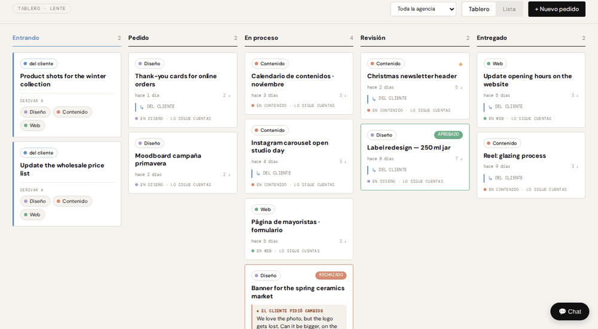
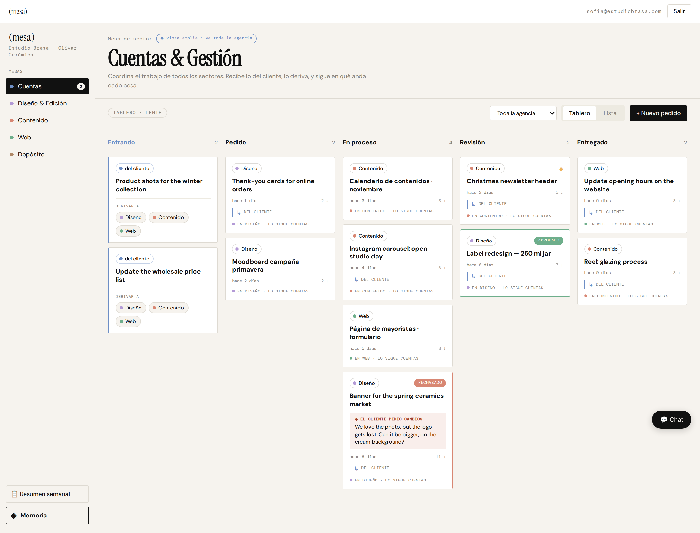
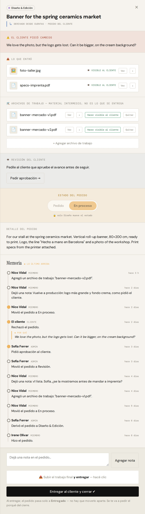
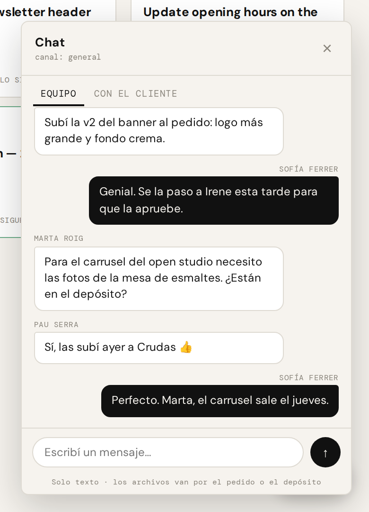
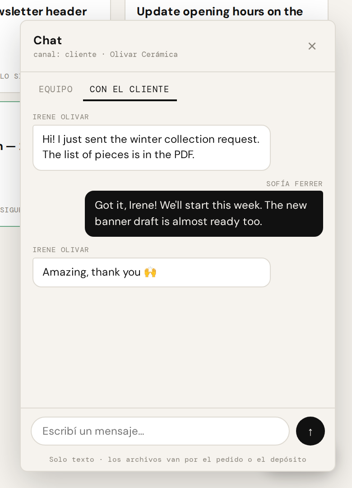
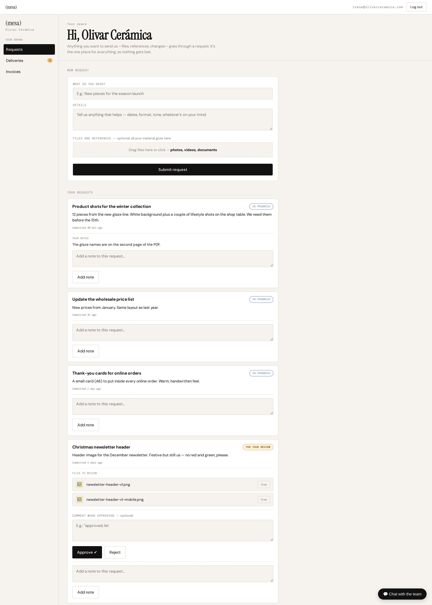
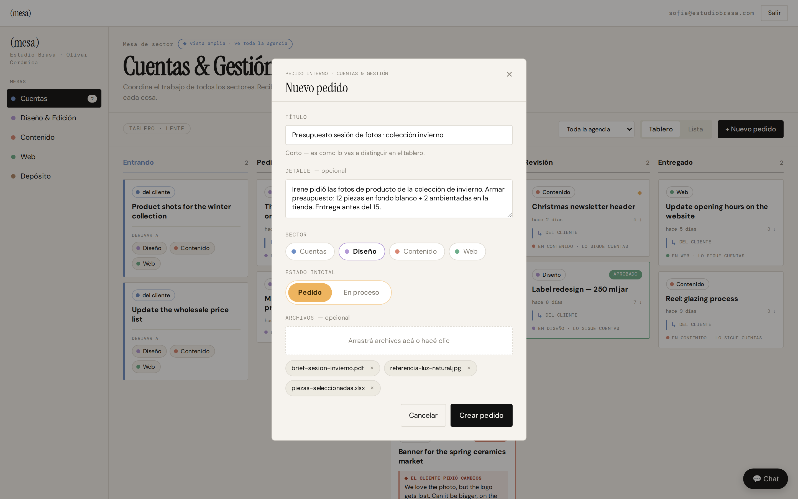

# MESA

**A case-management platform for creative agencies.** Every client request lives on one card, from the moment it comes in to the moment it's delivered, with a full record of who did what, when and why.

Live in production with a Barcelona creative agency across 4 departments (Accounts, Design, Content, Web).

> The production app runs privately for a client, so the screenshots come from a static replica of its interface with fictional data. The team-facing app is in Spanish, the client portal in English.

---

## The problem

Before MESA, everyone at the agency saw everything. There was no single owner between the client and the team, and every department was pulled into every job, which created bottlenecks. It was hard to say where a job was, who had it, or why it had changed.

## What I changed

The fix was partly software and mostly process:

- **One entry point.** Every request, from the client or from the team, becomes a card. Nothing is worked on outside a card.
- **Accounts as the single bridge to the client.** The Accounts team receives requests, routes them to the right department and follows them to delivery. Departments work their own queue and don't have to manage the client.
- **Role-based accounts.** Each person sees and can change only what their role needs. For example, only Design can move a design job's status.
- **The client gets their own portal** to send requests, review drafts, approve or reject, and chat with the team, instead of chasing people across channels.

---

## A tour

### 1. The board
Each column is a stage: *Incoming → Ordered → In progress → Review → Delivered*. Cards show the department, who is following them, how long they've been open and whether the client approved or asked for changes.

### 2. One request, its whole history
Everything about a job lives in one panel:
- the client's brief and files ("what came in");
- **working files**, kept separate from what the client sees until the team makes them visible;
- the client's review;
- the status control, locked to the department that owns the work;
- the **Memory**: an append-only log of every action, including the client's rejection and the reason for it.

### 3. Two chats, never mixed
The team channel and the client channel are separate tabs, so an internal comment can never reach the client by mistake. Files go through the request, not the chat.

| Team only | With the client |
| --- | --- |
|  |  |

### 4. The client portal
The client sees their requests with a status in plain language, reviews drafts, and approves or rejects with a comment. A rejection goes straight back to the team with the client's words attached.

### 5. Creating a request
Title, detail, department, initial status and files. Short on purpose: the card should be created in seconds.

---

## How it works

| Layer | What it does |
| --- | --- |
| **Supabase (PostgreSQL)** | Relational data model, storage for client and working files, real-time chat |
| **Row-level security** | Access enforced in the database, not hidden in the interface: a user who shouldn't see a record can't query it |
| **Append-only history** | Events are never edited or deleted, only added. Each event records who, what, when and why, and links to the event that caused it |
| **n8n** | Automations around the core: onboarding, document generation, reporting, and **milestone notifications** sent when a request lands in your queue, when a request is approved or rejected, and when the client has something to review |
| **Claude API** | **On-demand weekly summary:** looks back 7 days, filtered by brand, and returns what was done, what's pending and what needs attention |

## Design decisions

- **Security in the database, not the frontend.** Permissions live in Postgres policies. The interface can have bugs; the data stays protected.
- **History you can trust.** An append-only log means disputes ("we never asked for that") are settled by the record, not by memory.
- **Working files ≠ deliverables.** Drafts stay internal until someone decides the client should see them, so a half-finished file never reaches the client by accident.
- **Notify only when it's your move.** Notifications fire at key milestones and go only to the person who has to act. Chat never sends notifications: it's internal and read during working hours. Fewer alerts means people actually read the ones they get.
- **Delivery closes the job.** Delivering to the client moves the card to *Delivered* and asks for a reason, so nothing sits open forever.

---

Built by [Lautaro Ocorso](https://www.linkedin.com/in/lautaro-ocorso): design, data model, workflows and implementation.

The source code is private because it runs in production for a client. Happy to walk through it in a call.
